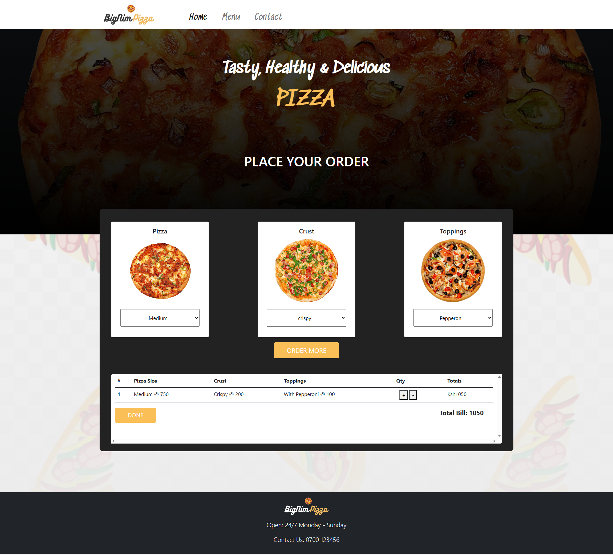

# BAT Bistro WordPress Theme



## Overview

BAT Bistro is a professional and responsive WordPress theme developed by Nimrod Musungu, specifically designed for restaurant and culinary businesses. The theme features a modern aesthetic with intuitive navigation and specialized components that highlight menus, reservations, testimonials, and other restaurant-specific features.

## Features

- **Responsive Design:** Ensures a seamless experience across desktops, tablets, and mobile devices
- **Restaurant-Focused Components:** Pre-built sections for menus, food galleries, testimonials, and reservation systems
- **Performance Optimized:** Built with speed and SEO in mind for better user experience and search engine visibility
- **Advanced Customization:** Easily customize colors, typography, and layouts through WordPress Customizer
- **Gulp Workflow:** Modern development workflow with Sass compilation, JavaScript bundling, and image optimization
- **Underscores Foundation:** Built on the solid foundation of Underscores (\_s) starter theme for WordPress

## Installation

1. **Download the Theme:** Clone or download the theme's repository
2. **Install Dependencies:** Run `npm install` to install development dependencies
3. **Build Assets:** Run `npm run build` to compile all assets
4. **Upload to WordPress:** Upload the theme to the WordPress themes directory (`/wp-content/themes/`)
5. **Activate Theme:** Activate BAT Bistro in the WordPress dashboard under "Appearance > Themes"

## Development

BAT Bistro uses a Gulp-based workflow for development:

```bash
# Install dependencies
npm install

# Development mode with live reloading
npm start

# Build for production
npm run build

# Create distributable package
npm run bundle
```

### File Structure

```
bat_bistro/
├── css/                   # Compiled CSS (generated)
├── dist/                  # Distribution files (generated)
├── images/                # Optimized images (generated)
├── inc/                   # Theme PHP includes
├── js/                    # JavaScript files
│   └── dist/              # Compiled JS (generated)
├── languages/             # Language files
├── sass/                  # Sass source files
│   ├── abstracts/         # Variables and mixins
│   ├── base/              # Base styles
│   ├── components/        # Component styles
│   └── ...
├── template-parts/        # Template partials
├── .gitignore             # Git ignore file
├── functions.php          # Theme functions
├── gulpfile.babel.js      # Gulp configuration
├── package.json           # Project dependencies
└── style.css              # Theme information
```

## Customization

- **WordPress Customizer:** Navigate to "Appearance > Customize" to modify theme settings
- **Menus:** Set up custom menus under "Appearance > Menus"
- **Widgets:** Add widgets to available sidebars under "Appearance > Widgets"
- **Templates:** Custom templates are available for different page layouts

## Support

For support, bug reports, or feature requests, please submit an issue on the GitHub repository or contact Nimrod Musungu directly.

## Credits

- **Developer:** Nimrod Musungu
- **Foundation:** Based on Underscores (\_s) by Automattic
- **Tools:** Built with Gulp, Sass, and modern web development practices

## License

This project is licensed under the [GPL v2 or later](LICENSE).
